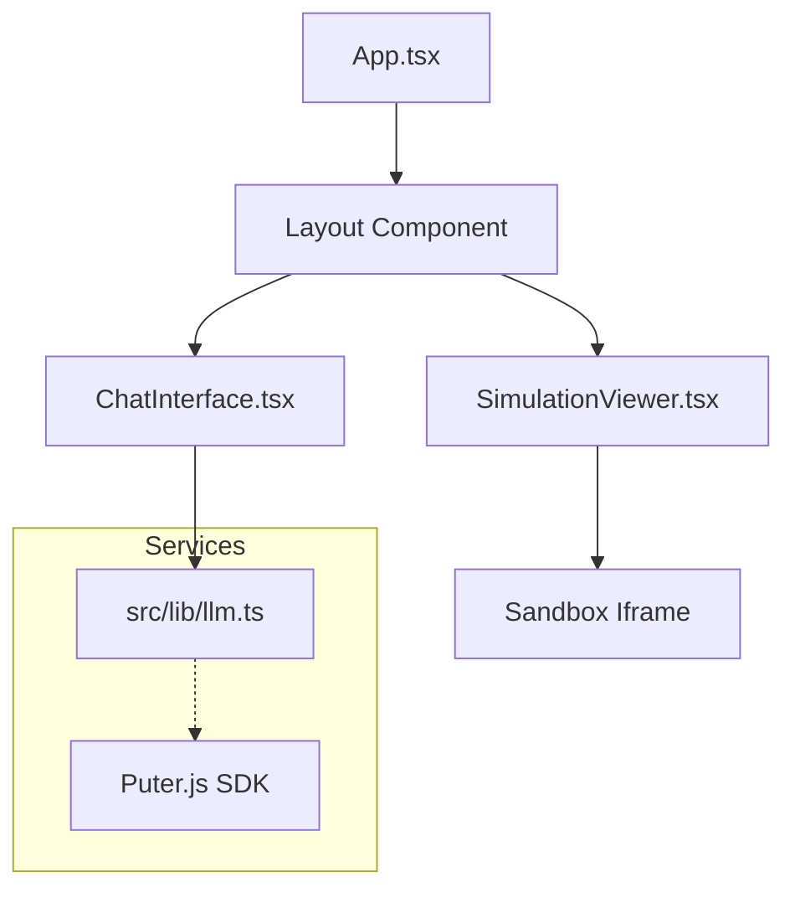

# VizuLab AI Developer Guide

This guide is intended for developers who want to contribute to VizuLab AI or understand its codebase.

## 1. Project Setup

### Prerequisites
*   Node.js (v18 or higher)
*   npm

### Installation
1.  Clone the repository:
    ```bash
    git clone https://github.com/your-repo/vizulab-ai.git
    cd vizulab-ai
    ```
2.  Install dependencies:
    ```bash
    npm install
    ```
3.  Start the dev server:
    ```bash
    npm run dev
    ```

## 2. Architecture Overview

VizuLab AI is a React-based Single Page Application (SPA). It leverages `Puter.js` to interface with the Gemini Flash LLM.

### Component Map



### Key Directories

*   **`src/components`**: UI components (Chat, SimulationViewer, etc.).
*   **`src/lib`**: Logic and helper functions.
    *   `llm.ts`: The core logic for interacting with the AI model.
*   **`src/types`**: TypeScript type definitions.

## 3. Core Logic Explanation

### AI Integration (`src/lib/llm.ts`)
The application does not use a traditional backend. Instead, it uses `puter.ai.chat` to directly communicate with the LLM from the client side.

**Flow:**
1.  User prompt is received.
2.  System prompt is prepended (defining the persona and output format).
3.  Request sent to `puter.ai.chat`.
4.  Response is parsed. It *must* return a valid HTML string containing the simulation code.

### Simulation Rendering
The `SimulationViewer` component handles the display of generated code. To ensure a consistent and responsive experience across devices, we inject a default style block into the generated HTML before rendering it.

**Style Injection:**
We prepend/inject a `<style>` block that:
- Resets margins and padding for `body` and `html`.
- Sets `width: 100vw` and `height: 100vh`.
- Forces `canvas` elements to `display: block` and take up 100% of the container size.
- Hides overflow to prevent scrollbars on the iframe body itself.

This ensures that any canvas-based simulation (like Three.js or standard Canvas API) fills the available iframe area completely.

### Sandboxing
Security is critical. The generated code is rendered inside an `iframe` with the `sandbox` attribute set to `allow-scripts allow-same-origin allow-popups allow-forms`. This setup:
- **allow-scripts**: Enables JavaScript execution, which is required for simulations.
- **allow-same-origin**: Allows requests to be treated as being from the same origin, which is often needed for local resource loading or complex script interactions.
- **allow-popups** & **allow-forms**: Added to support interactive elements within the generated simulations.

Despite `allow-same-origin`, the iframe effectively isolates the execution context from the main application's state and sensitive data (like tokens stored in closures), though care should still be taken.

## 4. Development Workflow

### Adding a New Feature
1.  Create a branch.
2.  Implement your changes.
3.  Ensure linting passes:
    ```bash
    npm run lint
    ```
4.  Submit a Pull Request.

### modifying the System Prompt
If you need to change how the AI generates code (e.g., to support a new library), modify the system prompt constant in `src/lib/llm.ts`.

## 5. Build for Production

```bash
npm run build
```

The output will be in the `dist/` directory.

---
*Happy Coding!*
