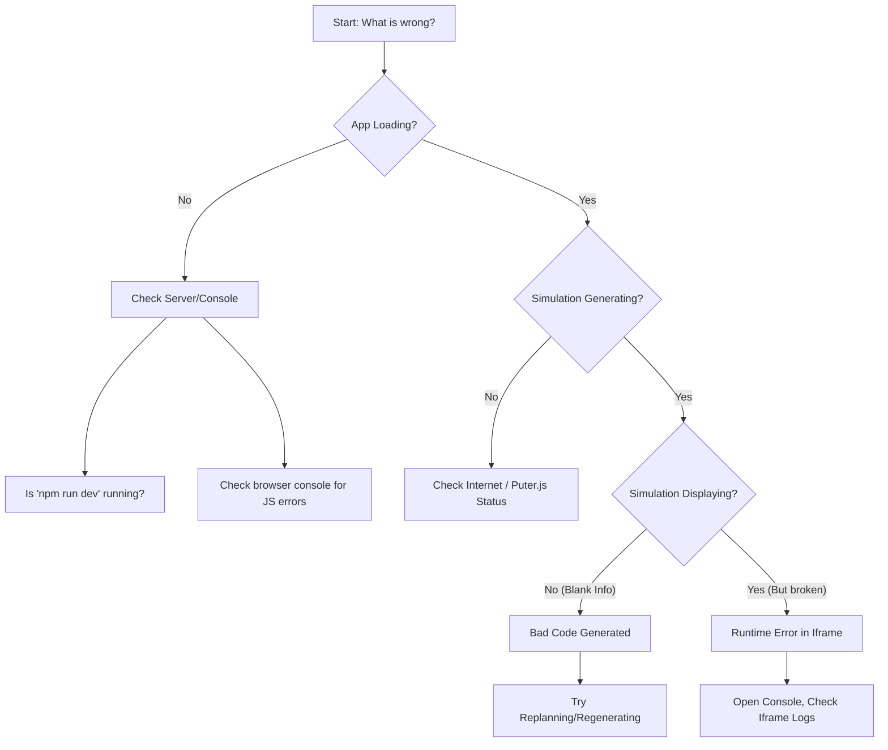

# VizuLab AI Troubleshooting Guide

Having trouble? Use this guide to diagnose and fix common issues.

## Debugging Flowchart

Start here to diagnose your issue:

## Common Issues & Solutions

### 1. Application Won't Start (`npm run dev` fails)
*   **Cause**: Missing dependencies or Node.js version mismatch.
*   **Fix**:
    *   Run `npm install` again.
    *   Ensure you are using Node 18+ (`node -v`).
    *   Check for port conflicts (is port 5173 used?).

### 2. "Puter is not defined" or AI Errors
*   **Cause**: The `Puter.js` script might fail to load or the service is down.
*   **Fix**:
    *   Check your internet connection.
    *   Look in the browser console (F12) for network errors related to `puter.com`.
    *   This app relies on third-party services which may occasionally experience downtime.

### 3. Generated Simulation is Blank
*   **Cause**: The AI generated code with syntax errors or code that crashes immediately.
*   **Fix**:
    *   **Don't panic.** This happens with LLMs.
    *   Type "Fix the blank screen" or "Regenerate" in the chat.
    *   Open "View Code" to see if the HTML looks valid.

### 4. Code Blocks are Empty or Weird
*   **Cause**: Parser failure.
*   **Fix**: The app expects the LLM to return code in a specific markdown or HTML format. If the LLM drifts from instructions, the parser might miss it. Try asking: "Please provide the full HTML code again."

### 5. Slow Generation
*   **Cause**: Complex prompts or high server load.
*   **Fix**: Be patient, or try a simpler prompt first.

## Getting Help

If you are still stuck, please start a discussion on our GitHub Issues page with:
1.  The prompt you used.
2.  A screenshot of the error.
3.  Any console logs (F12 > Console).
