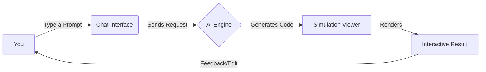

# VizuLab AI User Guide

Welcome to **VizuLab AI**, your personal generative simulation engine. This guide will help you get the most out of the platform.

## Overview

VizuLab AI allows you to create interactive web-based simulations, visualizations, and mini-games simply by describing them. You don't need to know how to code—the AI handles that for you!

## How It Works

The process is simple: you chat, and the AI builds.

## Step-by-Step Instructions

### 1. Enter Your Idea
In the chat box on the left, type a description of what you want to see. Be as creative as you like!

**Examples:**
*   "Create a solar system simulation where I can adjust the speed of the planets."
*   "Show me a sorting algorithm visualizer with bubble sort and quick sort."
*   "Make a bouncing ball physics demo with gravity controls."

### 2. Wait for Generation
The AI will process your request. You'll see a loading indicator in the simulation window (right side). This usually takes 5-10 seconds depending on the complexity.

### 3. Interact with the Simulation
Once complete, the simulation appears instantly on the right.
*   **Click & Drag**: Many simulations are interactive.
*   **Controls**: Look for buttons, sliders, or inputs generated by the AI within the simulation window.

### 4. View the Code
Curious how it works?
1.  Locate the **"View Code"** toggle or icon near the simulation window.
2.  Click it to reveal the HTML, CSS, and JavaScript code responsible for the visualization.
3.  You can copy this code and run it anywhere!

## Tips for Best Results

*   **Be Specific**: Instead of "make a chart", try "make a bar chart showing world population growth over the last 100 years, using bright colors."
*   **Iterate**: If the result isn't perfect, just ask for changes! "Make the balls bigger" or "Change the background to blue."
*   **Ask for Controls**: You can explicitly ask for UI elements. "Add a slider to control the number of particles."

## Troubleshooting

| Issue | Solution |
| :--- | :--- |
| **Simulation is blank** | The AI might have written invalid code. Try typing "Regenerate that" or simplify your prompt. |
| **"Error generating"** | Check your internet connection. If the issue persists, the AI service might be busy. |
| **Slow performance** | Complex simulations with thousands of particles can be slow. Ask the AI to "optimize for performance" or "reduce the particle count." |

---
*Enjoy creating with VizuLab AI!*
