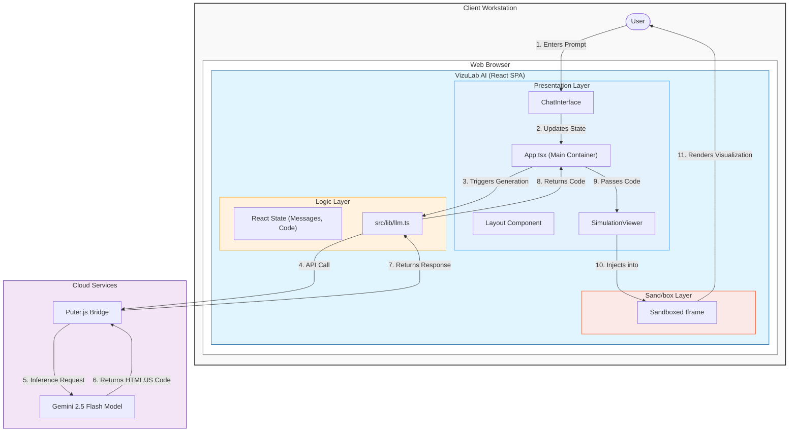
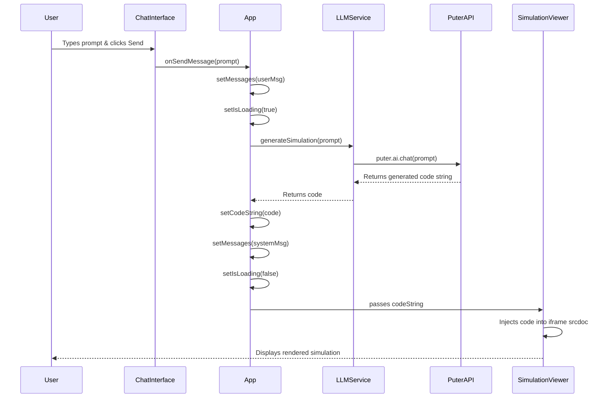

# Design Document: VizuLab AI

## 1. Architecture Overview
The application is a client-side Single Page Application (SPA) built with React. It uses **Puter.js** as a bridge to Large Language Models (LLM) (specifically Gemini 2.5 Flash) to generate visualization code.

### Data Flow
1. **User Input**: User enters a prompt in the `ChatInterface`.
2. **LLM Request**: App sends the prompt to `Puter.ai` via `src/lib/llm.ts`.
3. **Code Generation**: The LLM returns a raw HTML string containing the full visualization (Canvas/Three.js/JS).
4. **Rendering**: The `SimulationViewer` component injects this HTML into an `iframe` using `srcdoc` after injecting default styles to ensure full-viewport rendering.

## 2. Component Structure

### Component Interaction Flow

- **App**: Root component, manages state `messages` and `codeString`.
- **Layout**: Handles the responsive split-screen grid.
- **SimulationViewer**: Receives `codeString` and renders it safely in an iframe. Includes a toggle to view and copy the raw source code. Shows a loading spinner when empty.
- **ChatInterface**: Manages user input, displays chat history, and handles "Quick Start" suggestions.
- **lib/llm.ts**: Handles the async call to `puter.ai.chat`.

## 3. Technology Stack
- **Framework**: React 19 + Vite
- **Language**: TypeScript
- **Styling**: Tailwind CSS
- **Icons**: Lucide React
- **AI Integration**: Puter.js (Gemini 2.5 Flash)

## 4. Security & Safety
- **Sandbox**: Generated code runs in a sandboxed `iframe` (`allow-scripts`, `allow-same-origin`) to isolate execution.
- **No Backend**: logic is client-side, relying on the Puter.js environment.

## 5. UI Theme
- **Dark Mode**: Primary background Slate 900 (`#0f172a`).
- **Accents**: Purple/Indigo gradients (`text-purple-400`, `bg-indigo-500`) for a "Sci-Fi/Lab" aesthetic.
- **Glassmorphism**: Usage of `backdrop-blur-md` and semi-transparent backgrounds.
